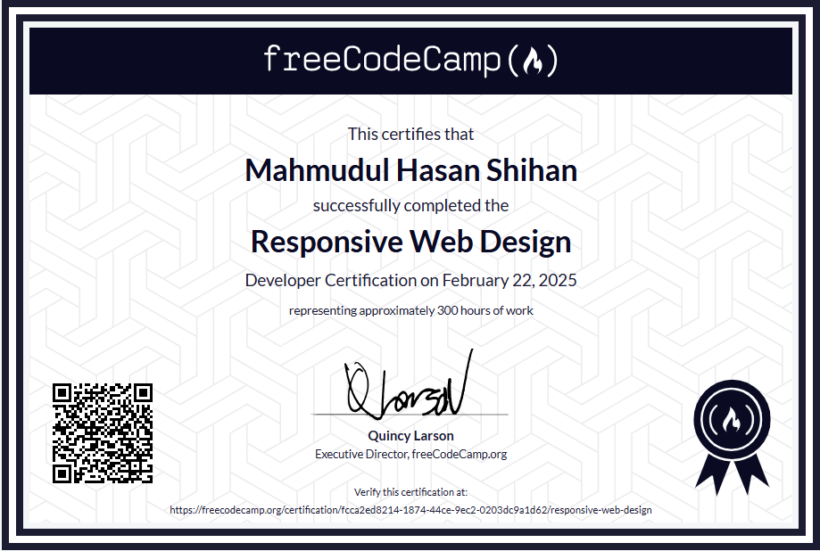
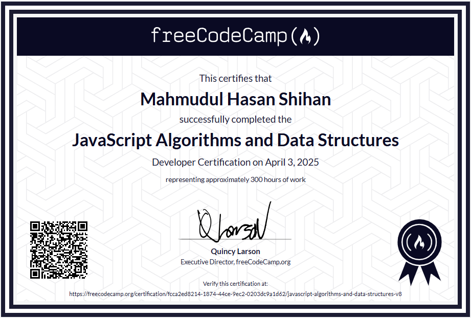
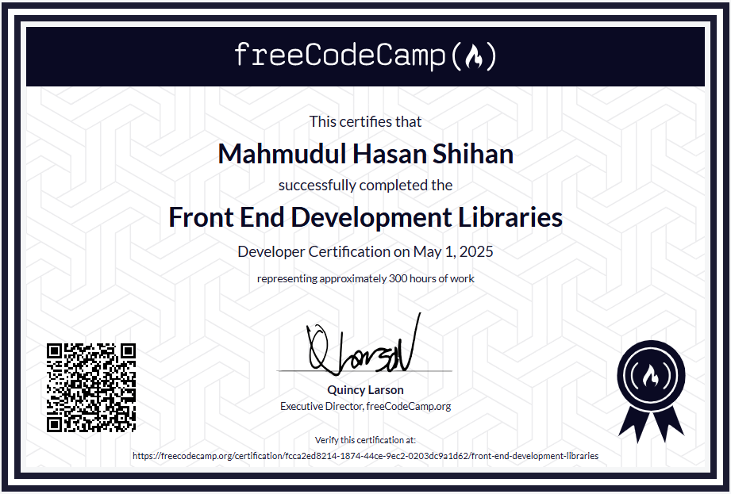

# 🎓 FreeCodeCamp Certification Projects

This repository contains **15 certification projects** I completed as part of the following three FreeCodeCamp courses:

- ✅ Responsive Web Design
- ✅ JavaScript Algorithms and Data Structures
- ✅ Front End Development Libraries

Each course includes **five projects** that demonstrate my understanding of the concepts and technologies taught in the course. This repo serves as both a personal portfolio and proof of certification.

---

## 🏅 My Certificates

### 📘 Responsive Web Design

### 📗 JavaScript Algorithms and Data Structures

### 📙 Front End Development Libraries

> 📎 Click a certificate to view verification on FreeCodeCamp.org

---

## 🏗️ Tech Stack & Tools

---

## 📘 Responsive Web Design

> Focused on HTML, CSS, Flexbox, Grid, and building responsive layouts.

1. **Tribute Page** – A simple tribute page for a famous person.  
   📁 [GitHub Link]()

2. **Survey Form** – A responsive form with various input types.  
   📁 [GitHub Link]()

3. **Product Landing Page** – A landing page for a fake product.  
   📁 [View on GitHub](https://github.com/mh-shihan/freeCodeCamp/tree/main/responsive-web-design/produc-landing-page)

4. **Technical Documentation Page** – Documentation for a fictional tech.  
   📁 [GitHub Link]()

5. **Personal Portfolio** – A portfolio showcasing my web design projects.  
   📁 [View on GitHub](https://github.com/mh-shihan/freeCodeCamp/tree/main/responsive-web-design/personal-portfolio)

---

## 📗 JavaScript Algorithms and Data Structures

> Covers ES6, regular expressions, recursion, algorithms, and object-oriented programming.

1. **Palindrome Checker** – Checks if a string is a palindrome, ignoring punctuation and case.  
   📁 [GitHub Link]()

2. **Roman Numeral Converter** – Converts numbers into Roman numerals (1–3999).  
   📁 [GitHub Link]()

3. **Caesars Cipher** – Implements ROT13 cipher for simple text encryption/decryption.  
   📁 [GitHub Link]()

4. **Telephone Number Validator** – Validates US phone numbers using regex.  
   📁 [GitHub Link]()

5. **Cash Register** – Simulates a cash register with change return logic.  
   📁 [GitHub Link]()

---

## 📙 Front End Development Libraries

> Focuses on React, Redux, Bootstrap, jQuery, and front-end state management.

1. **Random Quote Machine** – Displays random quotes and allows users to tweet them. Built with React.  
   📁 [GitHub Link]()

2. **Markdown Previewer** – Live preview of Markdown text using React and Marked.js.  
   📁 [GitHub Link]()

3. **Drum Machine** – Interactive drum pad app using React and keyboard events.  
   📁 [GitHub Link]()

4. **JavaScript Calculator** – A fully functional calculator built using React.  
   📁 [GitHub Link]()

5. **Pomodoro Clock** – A timer app for Pomodoro sessions and breaks. Built using React.  
   📁 [GitHub Link]()

---

## 📄 License

This repository is open-source and available under the [MIT License](LICENSE).

---

## 🙌 Acknowledgements

- Thanks to [freeCodeCamp](https://www.freecodecamp.org/) for providing such excellent, free resources to learn development.
