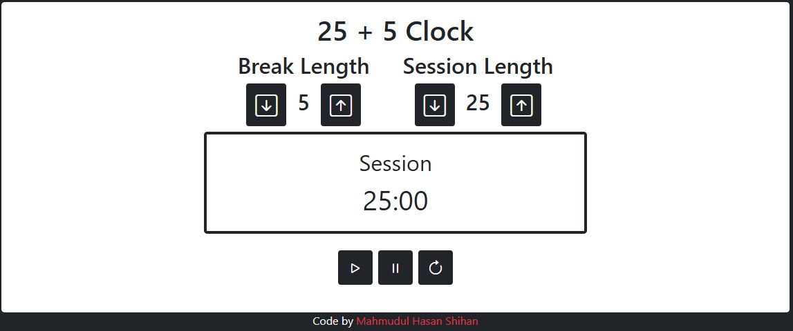

# 25 + 5 Clock

This is a **Pomodoro-style timer** built for the **freeCodeCamp Front End Libraries Certification**. It features a 25-minute session timer followed by a 5-minute break, with full functionality to start, pause, reset, and adjust session/break durations.

## 🛠 Features

- Adjust session and break lengths (1-60 minutes)
- Start / pause the timer
- Reset to default values
- Audible alarm when session/break ends
- Follows all [freeCodeCamp user stories](https://www.freecodecamp.org/learn/front-end-development-libraries/front-end-development-libraries-projects/build-a-25--5-clock)

## 💻 Live Demo

[🔗 View the live project here](https://codepen.io/Mahmudul-Hasan-Shihan/full/QwwOeow) <!-- Replace # with your live link -->

## 📸 Screenshot

 <!-- Add your screenshot file -->

## 📦 Tech Stack

- **React** (with hooks)
- **HTML5 + CSS3**
- Optional: Bootstrap / Tailwind / Sass
- Audio API for alarm
