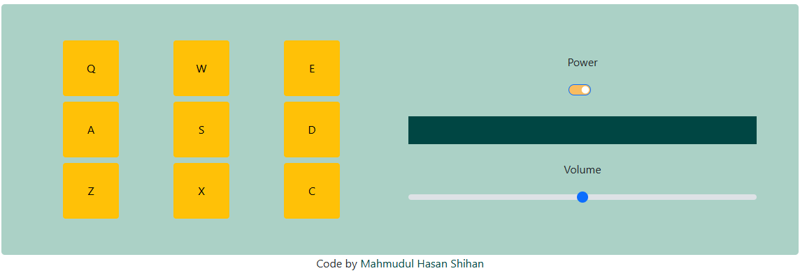

# 🥁 Drum Machine

## 📸 Preview

 <!-- Replace with actual screenshot if available -->

## 🔗 Live Demo

👉 [Click here to view the live project](https://codepen.io/Mahmudul-Hasan-Shihan/full/PwwOMOx) <!-- Replace with your actual link -->

This is a fun and interactive **Drum Machine** project built as part of the [FreeCodeCamp Front End Development Libraries Certification](https://www.freecodecamp.org/learn). The application allows users to play drum sounds using clickable pads or keyboard keys, delivering a satisfying audio and visual experience.

## 🚀 Features

- Responsive drum pads that play sounds on click or keypress.
- Visual feedback when a pad is activated.
- Display area shows the name of the sound being played.
- Keyboard shortcuts mapped to specific pads.
- Clean, modern UI design.

## 🛠️ Built With

- **HTML**
- **CSS** (or Tailwind CSS if applicable)
- **JavaScript**
- **React**
- **Audio clips** (hosted or embedded)

## 📦 Getting Started

1. Clone the repository:
   ```bash
   git clone https://github.com/mh-shihan/freeCodeCamp.git
   ```
