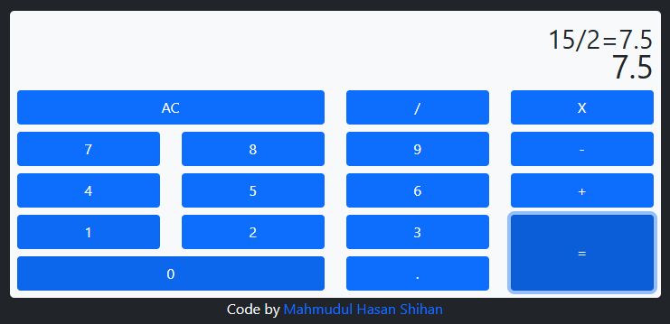

# 🧮 JavaScript Calculator

## 📸 Preview

 <!-- Replace with actual screenshot if available -->

This project is a JavaScript Calculator built as part of the [FreeCodeCamp Front End Development Libraries Certification](https://www.freecodecamp.org/learn/front-end-development-libraries/). It allows users to perform basic arithmetic operations with a clear and responsive interface.

## 🚀 Features

- Perform addition, subtraction, multiplication, and division
- Real-time expression evaluation
- Prevents invalid operations (e.g., multiple operators in a row)
- Responsive and accessible design
- Keyboard support (if implemented)

## 🛠️ Built With

- **HTML**
- **CSS** / **Tailwind CSS** _(if used)_
- **JavaScript**
- **React** (as required by FreeCodeCamp project)
- **React Hooks** (e.g., `useState`)

## 🔗 Live Demo

👉 [Click here to view the live calculator](https://codepen.io/Mahmudul-Hasan-Shihan/full/pvvdMqg)

1. Clone the repository:
   ```bash
   git clone https://github.com/mh-shihan/freeCodeCamp.git
   ```
