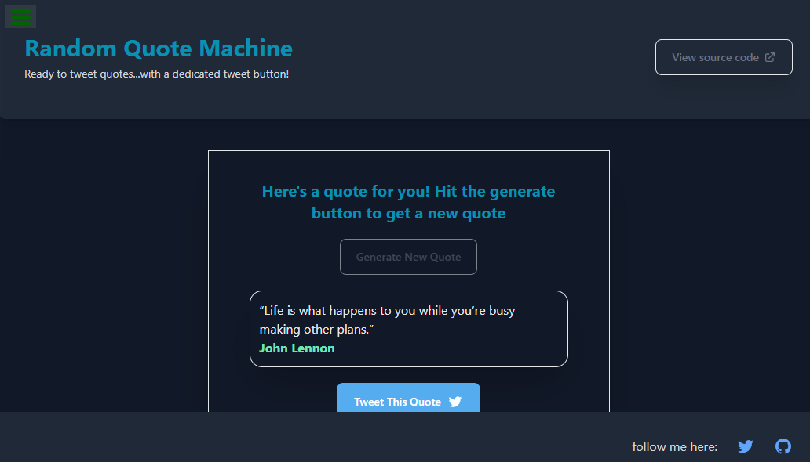

## 📸 Preview

 <!-- Replace with actual screenshot if available -->

## 🔗 Live Demo

👉 [Click here to view the live project](hhttps://codepen.io/Mahmudul-Hasan-Shihan/full/ByymXXX)

# 🎲 Random Quote Machine

This is a simple and interactive Random Quote Machine built as part of the [FreeCodeCamp Front End Development Certification](https://www.freecodecamp.org/learn). The application fetches and displays random quotes to inspire and entertain users. It also includes a feature to share quotes directly on Twitter.

## 🚀 Features

- Displays a random quote each time the user clicks the "New Quote" button.
- Quotes update without refreshing the page.
- Tweet the currently displayed quote with a single click.
- Clean and responsive UI.

## 🛠️ Built With

- **HTML**
- **CSS** (or Tailwind CSS if applicable)
- **JavaScript** (or React if you used it)
- **Quote API** or static quote array

1. Clone the repository:
   ```bash
   git clone https://github.com/mh-shihan/freeCodeCamp.git
   ```
